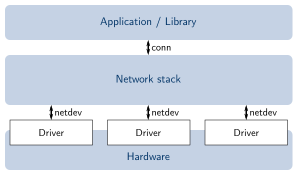

# TODO

* Überarbeiten und Übersetzen!
* [Doku zu Sock API](https://doc.riot-os.org/group__net__sock.html) nochmal anschauen

# 6. UDP Client / Server

The transport layer (UDP, TCP, etc) is accessed through [`sock`](https://doc.riot-os.org/group__net__sock.html) driver API



Look at the new modules in the [`Makefile`](Makefile)
```
USEMODULE += gnrc_ipv6_default
USEMODULE += gnrc_icmpv6_echo
USEMODULE += gnrc_sock_udp
```

[`udp.c`](udp.c) utilizes `sock_udp_send()` and `sock_udp_recv()` to exchange UDP packets

## Task 6.1: Use UDP for messaging
1. Compile and run on two `native` instances
2. We have two new shell commands: `udps` to start a server and `udp` to send a message.
   ```
   > help
   help
   Command              Description
   ---------------------------------------
   udp                  send udp packets
   udps                 start udp server
   reboot               Reboot the node
   version              Prints current RIOT_VERSION
   pm                   interact with layered PM subsystem
   ps                   Prints information about running threads.
   ping6                Ping via ICMPv6
   ping                 Ping via ICMPv6
   random_init          initializes the PRNG
   random_get           returns 32 bit of pseudo randomness
   nib                  Configure neighbor information base
   ifconfig             Configure network interfaces
   >
   ```

3. Start a UDP server on port 8888 with `udps 8888`.
   Look at the output of `ps`
   ```
   > ps
   ps
           pid | name                 | state    Q | pri | stack  ( used) ( free) | base addr  | current
             - | isr_stack            | -        - |   - |   8192 (   -1) ( 8193) | 0x5664a540 | 0x5664a540
             1 | idle                 | pending  Q |  15 |   8192 (  436) ( 7756) | 0x56648260 | 0x5664a0c0
             2 | main                 | running  Q |   7 |  12288 ( 3196) ( 9092) | 0x56645260 | 0x566480c0
             3 | ipv6                 | bl rx    _ |   4 |   8192 ( 1616) ( 6576) | 0x56654540 | 0x566563a0
             4 | udp                  | bl rx    _ |   5 |   8192 ( 1008) ( 7184) | 0x566524c0 | 0x56654320
             5 | gnrc_netdev_tap      | bl rx    _ |   2 |   8192 ( 2460) ( 5732) | 0x566568e0 | 0x56658740
             6 | UDP Server           | bl mbox  _ |   6 |   8192 ( 2452) ( 5740) | 0x56643220 | 0x56645080
               | SUM                  |            |     |  61440 (11168) (50272)
   >
   ```
   The new thread for the UDP server has the PID 6 in this example.

4.  Get your IPv6 address using `ifconfig`
    ```
    > ifconfig
    ifconfig
    Iface  5  HWaddr: 36:1D:81:86:7D:21
              L2-PDU:1500  MTU:1500  HL:64  Source address length: 6
              Link type: wired
              inet6 addr: fe80::341d:81ff:fe86:7d21  scope: link  VAL
              inet6 group: ff02::1
              inet6 group: ff02::1:ff86:7d21
    ```

5.  From the second instance, send a udp packet with the `udp` command.
    ```
    > udp fe80::341d:81ff:fe86:7d21 8888 hello
    udp fe80::341d:81ff:fe86:7d21 8888 hello
    Success: send 5 byte to fe80::341d:81ff:fe86:7d21
    ```

## Task 6.2: Communicate with Linux
1.  Compile and run on two `native` instances
2.  Start a UDP server on port 8888 with `udps 8888`.
3.  Send a packet to RIOT from Linux using `netcat`
    ```sh
    echo "hello" | nc -6u <RIOT-IPv6-addr>%tapbr0 8888
    ```
    Note: on MAC use `bridge0` instead of `tapbr0`.

4.  Start a UDP server on the host machine with `netcat`.
    ```
    nc -6lu 8888
    ```
    And in RIOT ...
    ```
    udp <tap0-IPv6-addr> 8888 hello
    ```
[Read the Doc](https://doc.riot-os.org/group__net__sock.html)

## Task 6.3 -- Exchange UDP packets with your neighbors
* Compile, flash and run on the board `BOARD=samr21-xpro make all flash term`
* Send and receive UDP messages to and from your neighbors using `udp` and `udps`

[next task](../task-07)