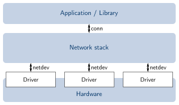

# RIOT UDP Networking

In diesem Tutorial wollen wir verschlüsselte Daten über das Netzwerk schicken, da nur In-Memory Verschlüsselung wenig Sinn macht.

Hierzu machen wir Gebrauch von zwei Treiber APIs für RIOT:

1. [Netdev API](https://doc.riot-os.org/group__drivers__netdev__api.html): zum Empfangen und Senden von Daten
2. [Sock API](https://doc.riot-os.org/group__net__sock.html): als Schnittstelle für Protokolle des Transport Layers wie TCP und UDP



## Anpassen der Makefile

Include `netdev` Module:

```diff
+  USEMODULE += gnrc_netdev_default     # Default Netzwerkinterfaces für das Board verwenden
+  USEMODULE += auto_init_gnrc_netif    # Auto-Initialisierung der Netzwerkinterfaces
```

Include `sock` Module:

```diff
+  USEMODULE += gnrc_ipv6_default       # IPv6 Protokoll
+  USEMODULE += gnrc_icmpv6_echo        # ICMPv6 Protokoll für echo Anfragen
+  USEMODULE += gnrc_sock_udp           # UDP Protokoll
```

## Headerdatei `net/sock/udp.h`

Relevant für uns sind Socket Endpunkte vom Typ `sock_udp_ep_t`, welche ein Alias bzw. `typedef` von `_sock_tl_ep` sind. Diese Struktur ist im Header `net/sock/udp.h` definiert: 

```c
 struct _sock_tl_ep {
     int family;
 
     union {
 #ifdef SOCK_HAS_IPV6
 
         uint8_t ipv6[16];
 #endif
         uint8_t ipv4[4];        
         uint32_t ipv4_u32;      
     } addr;                 
     uint16_t netif;
     uint16_t port;          
 };
```

Diese Struktur stellt einen Endpunkt für einen UDP Sock dar. Die für Netzwerke üblichen Informationen wie verwendete [UNIX Adressenfamilie](https://riot-os.org/api/group__net__af.html), IPv4/6 Modus, Adresse, Port und Netzwerk Interface ID werden in den entsprechenden Feldern gespeichert.

Ein konkretes Socket Objekt erstellen wir mit der Funktion `sock_udp_create`, die ebenfalls im Header definiert ist:
```c
 int sock_udp_create(sock_udp_t *sock, const sock_udp_ep_t *local,
                     const sock_udp_ep_t *remote, uint16_t flags);
```

Damit lässt sich ein Socket vom Typ `sock_udp_t` an einen Endpunkt vom Typ `sock_udp_ep_t` binden. Zum Empfangen von Nachrichten wird der lokale Endpunkt `const sock_udp_ep_t *local`, zum Senden der Remote Endpunkt `const sock_udp_ep_t *remote` als Parameter benötigt. Falls benötigt, können optionale [Sock Flags](https://riot-os.org/api/group__net__sock.html#net_sock_flags) gesetzt werden.

Bei Erfolg wird ein `int` vom Wert 0, andernfalls spezifische Fehlercodes zurückgeliefert.

Zum Empfangen von Nachrichten wird die Funktion `sock_udp_recv` benötigt...

```c
 static inline ssize_t sock_udp_recv(sock_udp_t *sock,      //UDP Socket, darf nicht NULL sein
                                     void *data,            //Pointer zum Speichern von empfangenen Daten
                                     size_t max_len,        //Länge der Daten
                                     uint32_t timeout,      //Timeout bevor Datenempfang beendet wird
                                     sock_udp_ep_t *remote  //Remote Endpunkt, darf NULL sein
                                     )
```

...und zum Senden die Funktion `sock_udp_send`.

```c
 static inline ssize_t sock_udp_send(sock_udp_t *sock,              //UDP Socket, darf NULL sein
                                     const void *data,              //Pointer zum Speichern von empfangenen Daten
                                     size_t len,                    //Länge der Daten
                                     const sock_udp_ep_t *remote    //Remote Endpunkt, darf nicht NULL sein
                                     )
```

Als Rückgabewert liefern beide Funktionen jeweils die Anzahl an empfangenen bzw. gesendeten Bytes bzw. spezifische Fehlercodes.

## Headerdatei `thread.h`

Der UDP Server soll in einem Thread ausgeführt werden und im Hintergrund auf Nachrichten warten. Hierfür benötigen wir aus diesem Header die Funktion `thread_create`:

```c
 kernel_pid_t thread_create(char *stack,                    //Startadresse des allozierten Stackspeichers
                            int stacksize,                  //Stackgröße des Threads in Bytes
                            uint8_t priority,               //Priorität des Threads (niedriger Wert = höhere Priorität)
                            int flags,                      //optionale Flags während Threaderstellung
                            thread_task_func_t task_func,   //Pointer zur auszuführenden Funktion
                            void *arg,                      //Funktionsargumente
                            const char *name                //Menschenlesbare Thread-Bezeichnung
                            );
```

Zurückgegeben wird durch die Funktion die PID des Threads vom Typ `kernel_pid_t`.

Die komplette Erstellung des UDP Servers werden wir in einer separaten Funktion auslagern. Den Pointer zu dieser Funktion geben wir dann beim Aufruf von `thread_create` als Argument für `task_func` mit.

# Programm zum Empfangen von mit AES-CBC verschlüsselten Daten

[Hier](../../tutorial_code/udp-tutorial) ist das C-Programm, welches wir nun genauer betrachten werden.

## `udp.c`

In dieser Klassendatei wurden die maßgeblichen Funktionen zum Starten eines UDP Servers sowie das Senden/Empfangen von AES-verschlüsselten Nachrichten ausgelagert.

### Empfangen von Daten

Gleich zu Beginn erkennen wir den Schlüssel sowie die Initialisierungsschritte für AES wieder.

 Pro RIOT Instanz soll nur ein UDP Server laufen, was mit `static bool server_running` abgeprüft wird.
```c
...

static bool server_running = false;
static sock_udp_t sock;
static uint8_t key[] = {
    0x64, 0x52, 0x67, 0x55,
    0x6B, 0x58, 0x70, 0x32,
    0x73, 0x35, 0x75, 0x38,
    0x78, 0x2F, 0x41, 0x3F};

// Erhält als Argument den Pointer zu den ersten Befehlsargument
void *_udp_server_thread(void *args)
{

    // ################### Initialisierung der cipher_t Struktur ###################
    cipher_t cipher;

    int err = cipher_init(&cipher, CIPHER_AES_128, key, AES_KEY_SIZE);

    if (err != CIPHER_INIT_SUCCESS)
    {
        return (void *)err;
    }
    
...
```

`_udp_server_thread` bezeichnet die Funktion, die durch den Thread ausgeführt werden soll. Der Port wird vom Nutzer als Argument mitgegeben.

```c
    // ################### Initialisieren des UDP Socket Endpoints ###################
    sock_udp_ep_t server = {
        .port = atoi(args), // Parse den Port für den UDP Server
        .family = AF_INET6  // Nutze IPv6
    };
```

Hier eine Initialisierung des Endpunktes mit minimalen Attributen. Der übergebene Port wird mithilfe von `atoi` von einem String zu `int` konvertiert. Da wir IPv6 und UDP verwenden wollen, muss `.family` als die Konstante `AF_INET6` gesetzt werden.

```c
    // ################### Initialisieren der UDP Socket ###################
    if (sock_udp_create(&sock, &server, NULL, 0) < 0)
    {
        return NULL;
    }
```

Der Socket wird nun mit `sock_udp_create` erstellt und geprüft, ob die Operation erfolgreich war.

```c
    // ################### Hilfstruktur ###################
    struct
    {
        size_t encrypted_data_len; // Größe der verschlüsselten Nachricht
        void *encrypted_data_buf;  // Buffer, in dem die verschlüsselte Nachricht gespeichert werden soll
        uint8_t iv[16];            // Initialisierungsvektor
        bool has_iv;               // Ob der IV schon erhalten wurde
    } server_state = {
        .encrypted_data_len = 0,
        .encrypted_data_buf = NULL,
        .has_iv = false,
    };
```

Hier initialisieren wir eine Hilfstruktur, die Informationen zur verschlüsselten Nachricht enthalten wird, u.A. der aus AES-CBC bekannte Initialisierungsvektor.
```c
    server_running = true;

    printf("Success: started UDP server on port %u\n", server.port);
```

Der Server wurde (einmalig) gestartet und `server_running` kann damit auf `true` gesetzt werden. Mit der Konsolenausgabe wird der ordnungsgemäße Start des UDP Servers bestätigt.

```c
    // ################### Hilfsmakro, um UDP Daten zu empfangen und auf Fehler zu Prüfen ###################
#define RECV_AND_CHECK(buffer, size)                                              \
    do                                                                            \
    {                                                                             \
        int received = sock_udp_recv(&sock, buffer, size, SOCK_NO_TIMEOUT, NULL); \
                                                                                  \
        if (received < 0)                                                         \
        {                                                                         \
            printf("Error while receiving: %d\n", received);                      \
            exit(received);                                                       \
        }                                                                         \
        else if (received == 0)                                                   \
        {                                                                         \
            puts("No data received");                                             \
            exit(received);                                                       \
        }                                                                         \
    } while (0)
```

Mit dem Makro `RECV_AND_CHECK` wird auf eingehende Daten geprüft. Beim Aufruf von `sock_udp_recv` wird `SOCK_NO_TIMEOUT` als 4. Argument übergeben, sodass die Funktion "unendlich lange" wartet.

```c
    while (true)
    {
        // Wenn der Initialisierungsvektor noch nicht empfangen wurde
        if (!server_state.has_iv)
        {
            ...
        }
        // Wenn stattdessen die Größe der Nachricht noch nicht bekannt ist
        else if (server_state.encrypted_data_len == 0)
        {
            ...
        }
        else
        {
            ...
        }
    }
```

Nach und nach sollen in einer Endlosschleife soll die noch leere Struktur `server_state` mit den Informationen aus den empfangenen Daten gefüllt werden u.A. der IV und die Nachrichtenlänge.

```c
        else
        {
            RECV_AND_CHECK(server_state.encrypted_data_buf, server_state.encrypted_data_len); // Empfange die verschlüsselte Nachricht
            uint8_t *decrypted = malloc(server_state.encrypted_data_len);                     // Alloziere den Buffer für die entschlüsselte Nachricht

            printf("Received encrypted Data: \n");
            od_hex_dump_ext(server_state.encrypted_data_buf, server_state.encrypted_data_len, AES_BLOCK_SIZE, 0);
```

Im `else`-Zweig wird schließlich die tatsächliche (noch verschlüsselte) Nachricht empfangen, via Object Dump auf der Konsole ausgegeben...

```c
            // Entschlüssle die verschlüsselte Nachricht
            int err = cipher_decrypt_cbc(&cipher, server_state.iv, server_state.encrypted_data_buf, server_state.encrypted_data_len, decrypted);

            if (err < 0)
            {
                printf("Failed to decrypt data: %d\n", err);
            }
            else
            {
                printf("Decrypted Data: \n");
                od_hex_dump_ext(decrypted, server_state.encrypted_data_len, AES_BLOCK_SIZE, 0);
            }
```

...und diese dann entschlüsselt und erneut ausgegeben.

```c
            // Gebe die beiden Buffer wieder frei

            free(server_state.encrypted_data_buf);
            free(decrypted);

            // Bereite vor auf die nächste Nachricht

            server_state.encrypted_data_len = 0;
            server_state.has_iv = false;
        }
    }

#undef RECV_AND_CHECK

    return NULL;
}
```

Beide allozierten Buffer müssen zum Schluss wieder freigegeben und die Daten im `server_state` zurückgesetzt werden.

### Senden von Daten

```c
int udp_send(int argc, char **argv)
{
    static cipher_t cipher;
    static bool init_cipher = false;

    // ################### Überprüfe Befehl auf korrekte Syntax ###################
    if (argc != 4)
    {
        printf("Usage: %s <ipv6-addr> <port> <payload>\n", argv[0]);
        return -1;
    }
```

Bevor das Senden starten kann, wird zunächst die Syntax des Befehls geprüft.

```c
    // ################### Initialisierung der cipher_t Struktur ###################
    if (!init_cipher)
    {
        int err = cipher_init(&cipher, CIPHER_AES_128, key, AES_KEY_SIZE);

        if (err != CIPHER_INIT_SUCCESS)
        {
            return err;
        }

        init_cipher = true;
    }

    // ################### Generierung des Initialisierungsvektors ###################

    uint8_t iv[16];
    random_bytes(iv, 16); // TODO: use cryptographically secure RNG

    // ################### Initialiserung des UDP Remote Endpoints ###################
    sock_udp_ep_t remote = {.family = AF_INET6};
```

Die Initialisierung der `cipher_t` Struktur sowie des Remote Endpunktes verläuft analog zu der beim Empfangen von Daten. Ebenfalls bekannt aus [Teil 5: AES-CBC](05_AES_CBC.md) ist das Befüllen des IV mithilfe von `random_bytes`.

```c
    // Parsen der IPv6 Adresse welche als String in argv[1] gespeichert ist
    if (ipv6_addr_from_str((ipv6_addr_t *)&remote.addr, argv[1]) == NULL)
    {
        puts("Error: unable to parse destination address");
        return 1;
    }

    if (ipv6_addr_is_link_local((ipv6_addr_t *)&remote.addr))
    {
        // Wenn es sich um eine Link-Local IPv6 Addresse handelt, nehme das Erste Interface
        // gnrc_netif_iter mit NULL gibt das erste Element der Iteration zurück
        remote.netif =  (uint16_t) (gnrc_netif_iter(NULL)->pid);
    }

    // Parse den Port
    remote.port = atoi(argv[2]);
```

Um Parsen der IPv6 Adresse werden zwei Hilfsmethoden aus dem Header `net/ipv6/addr.h` verwendet:

1. `ipv6_addr_from_str`: Konvertiert eine IPv6 Adresse von einem String in ein `ipv6_addr_t` Objekt, das die Adresse in Bytes repräsentiert. 
2. `ipv6_addr_is_link_local`: Zur Prüfung von Link-local IPv6 Adressen, da unsere RIOT Instanzen sich im gleichen Netzwerk befinden.

Das Parsen des Ports via `atoi` erfolgt ebenfalls wie bisher.

```c
    // ################### Hilfsmakro, um Daten an den Remote-Endpoint zu shicken, überprüft automatisch auf Fehler ###################
#define SEND_AND_CHECK(buffer, size, on_err)                   \
    do                                                         \
    {                                                          \
        int sent = sock_udp_send(NULL, buffer, size, &remote); \
                                                               \
        if (sent < 0)                                          \
        {                                                      \
            printf("Could not send data: %d\n", sent);         \
            on_err return sent;                                \
        }                                                      \
    } while (0)
```

Analog zum Makro `RECV_AND_CHECK` wird hier nun ein Makro `SEND_AND_CHECK` verwendet.

```c
    // ################### Berechnen der Finalen Nachrichtengröße (auf AES_BLOCK_SIZE) gepadded ###################

    size_t input_data_len = strlen(argv[3]) + 1; // +1 für 0 Byte
    size_t n_aes_blocks = input_data_len / AES_BLOCK_SIZE;

    if ((input_data_len % AES_BLOCK_SIZE) != 0)
    {
        n_aes_blocks++;
    }

    size_t encrypted_msg_len = n_aes_blocks * AES_BLOCK_SIZE;
```

Da die Nachrichtengröße ebenfalls verschickt wird, muss sie hier zuerst ermittelt werden.

```c
    // ################### Erstellen des gepaddeten Inputs ###################

    uint8_t *padded_input = (uint8_t *)calloc(n_aes_blocks, AES_BLOCK_SIZE);
    memcpy(padded_input, argv[3], input_data_len);

    // ################### Allozieren des Ausgabebuffers ###################

    uint8_t *encrypted = (uint8_t *)malloc(encrypted_msg_len);

    // ################### Verschlüsseln des gepaddeten Inputs ###################

    int err = cipher_encrypt_cbc(&cipher, iv, padded_input, encrypted_msg_len, encrypted);

    if (err < 0)
    {
        printf("Failed to encrypt data: %d\n", err);

        free(padded_input);
        free(encrypted);

        return err;
    }
```

Diese drei Schritte erfolgen analog zu bisher (siehe [Teil 5: AES-CBC](05_AES_CBC.md))

```c
    // ################### Senden des Initialisierungsvektors ###################

    printf("Sending IV:\n");
    od_hex_dump_ext(iv, 16, 0, 0);

    SEND_AND_CHECK(iv, 16, );

    // ################### Senden der Nachrichtengröße ###################

    printf("Sending message size: %zu\n", encrypted_msg_len);
    SEND_AND_CHECK(&encrypted_msg_len, sizeof(size_t),
                   free(padded_input);
                   free(encrypted););

    // ################### Senden der verschlüsselten Nachricht ###################

    printf("Sending Encrypted data:\n");
    od_hex_dump_ext(encrypted, encrypted_msg_len, AES_BLOCK_SIZE, 0);

    SEND_AND_CHECK(encrypted, encrypted_msg_len,
                   free(padded_input);
                   free(encrypted););
```

Schließlich werden IV, Nachrichtengröße und die verschlüsselte Nachricht nacheinander über UDP verschickt.

```c
    // ################### Aufräumen ###################

    free(padded_input);
    free(encrypted);

#undef SEND_AND_CHECK

    return 0;
}
```

Unabhängig davon ob das Senden erfolgreich war oder fehlschlug, werden die Buffer `padded_input` und `encrypted` wieder freigegeben.

### Threaderstellung

```c
int udp_server(int argc, char **argv)
{
    static char server_thread_stack[THREAD_STACKSIZE_DEFAULT]; // static, damit Lifetime buffer > Lifetime der Funktion

    if (argc != 2)
    {
        puts("Usage: udps <port>");
        return -1;
    }

    if (server_running)
    {
        printf("Server already running\n");
        return -1;
    }

    kernel_pid_t server_thread = thread_create(server_thread_stack, sizeof(server_thread_stack), THREAD_PRIORITY_MAIN - 1, THREAD_CREATE_STACKTEST, _udp_server_thread, argv[1], "UDP Server Thread");

    if (server_thread <= KERNEL_PID_UNDEF)
    {
        printf("Failed to start server thread\n");
        return -1;
    }

    server_running = true;

    return 0;
}
```

In dieser Funktion wird der Thread erstellt, welcher dann wiederum `_udp_server_thread` für das Starten des UDP Servers ausführt.

## `main.c`

```c
#include <stdio.h>
#include <string.h>

#include "msg.h"
#include "shell.h"

#define MAIN_QUEUE_SIZE     (8)
static msg_t _main_msg_queue[MAIN_QUEUE_SIZE];

extern int udp_send(int argc, char **argv);
extern int udp_server(int argc, char **argv);

static const shell_command_t shell_commands[] = {
    { "udp", "send udp packets", udp_send },
    { "udps", "start udp server", udp_server },
    { NULL, NULL, NULL }
};

int main(void)
{
    msg_init_queue(_main_msg_queue, MAIN_QUEUE_SIZE);

    char line_buf[SHELL_DEFAULT_BUFSIZE];
    shell_run(shell_commands, line_buf, SHELL_DEFAULT_BUFSIZE);

    return 0;
}
```

Die Hauptklasse `main.c` greift mit dem Keyword `extern` auf die in `udp.c` definierten Funktionen zu.

Für das Senden und Empfangen/Starten des UDP Servers werden zwei Custom Commands erstellt und in `shell_commands` gespeichert.

Da hier asynchrone IPC (Interprozesskommunikation) benötigt wird, müssen wir in der `main` Methode eine Message Queue initialisieren. Das Header `msg.h` bietet hierfür die Funktion `msg_init_queue()`. Da als Länge der Queue eine Zweierpotenz erforderlich ist, wurde der Wert 2³ = 8 Nachrichten verwendet.

## Ausführen des Programms

Zuerst wird ein virtuelles Netzwerkinterface erstellt. Vom aktuellen Verzeichnis führen wir folgenden Befehl aus:

```sh
sudo ./../.base/dist/tools/tapsetup/tapsetup -c 2
```

Damit werden zwei TAP Interfaces `tap0` and `tap1` sowie eine Bridge `tapbr0` (Linux) bzw. `bridge0` (OSX) erstellt.

Nun müssen zwei RIOT Instanzen kompiliert werden. Dies kann man am einfachsten über zwei Terminals erreichen:

Terminal 1: `make all term PORT=tap0`

Terminal 2: `make all term PORT=tap1`

In diesem Programm sind einige neue Befehle hinzugekommen, die wir uns in der RIOT Shell mit `help` anschauen:

```
> help
help
Command              Description
---------------------------------------
udp                  send udp packets
udps                 start udp server
reboot               Reboot the node
version              Prints current RIOT_VERSION
pm                   interact with layered PM subsystem
ps                   Prints information about running threads.
ping6                Ping via ICMPv6
ping                 Alias for ping6
random_init          initializes the PRNG
random_get           returns 32 bit of pseudo randomness
nib                  Configure neighbor information base
ifconfig             Configure network interfaces
```

Die IP-Adresse beider Instanzen lässt sich mit `ifconfig` ermitteln.

Terminal 1:
```
> ifconfig
ifconfig
Iface  5  HWaddr: D6:88:DD:6C:B7:D3 
          L2-PDU:1500  MTU:1500  HL:64  Source address length: 6
          Link type: wired
          inet6 addr: fe80::d488:ddff:fe6c:b7d3  scope: link  VAL
          inet6 group: ff02::1
          inet6 group: ff02::1:ff6c:b7d3
```

Terminal 2:
```
> ifconfig
ifconfig
Iface  5  HWaddr: 9E:96:15:79:0C:45 
          L2-PDU:1500  MTU:1500  HL:64  Source address length: 6
          Link type: wired
          inet6 addr: fe80::9c96:15ff:fe79:c45  scope: link  VAL
          inet6 group: ff02::1
          inet6 group: ff02::1:ff79:c45
```

Starten wir nun den UDP Server auf beiden Instanzen mit den Ports 8888 und 8889:

Terminal 1:
```
> udps 8888 
udps 8888
Success: started UDP server on port 8888
```

Terminal 2:
```
> udps 8889 
udps 8889
Success: started UDP server on port 8889
```

Betrachten wir nun die Syntax für den ´udp´ Befehl, um eine Nachricht zu versenden:

```
> udp
udp
Usage: udp <ipv6-addr> <port> <payload>
```

Von Terminal 1 soll nun eine Nachricht an Terminal 2 verschickt werden:

Terminal 1:
```
> udp fe80::9c96:15ff:fe79:c45 8889 "Geheime Nachricht"
udp fe80::9c96:15ff:fe79:c45 8889 "Geheime Nachricht"
Sending IV:
00000000  30  1F  04  00  B5  D4  94  57  E4  18  F8  44  15  23  1F  03  0......W...D.#..
Sending message size: 32
Sending Encrypted data:
00000000  98  C2  47  D9  BB  06  17  D6  00  19  1C  FD  CE  08  EF  93  ..G.............
00000010  10  75  BD  DD  4B  C5  A9  F5  B6  38  03  37  20  6F  B7  F6  .u..K....8.7 o..
```

Terminal 2:
```
> Received IV: 
00000000  30  1F  04  00  B5  D4  94  57  E4  18  F8  44  15  23  1F  03  0......W...D.#..
Expecting a message of size 32
Received encrypted Data: 
00000000  98  C2  47  D9  BB  06  17  D6  00  19  1C  FD  CE  08  EF  93  ..G.............
00000010  10  75  BD  DD  4B  C5  A9  F5  B6  38  03  37  20  6F  B7  F6  .u..K....8.7 o..
Decrypted Data: 
00000000  47  65  68  65  69  6D  65  20  4E  61  63  68  72  69  63  68  Geheime Nachrich
00000010  74  00  00  00  00  00  00  00  00  00  00  00  00  00  00  00  t...............
```

<-- [Teil 5: AES-CBC](05_AES_CBC.md) -- [Teil 7: Relic](07_Relic.md) -->
